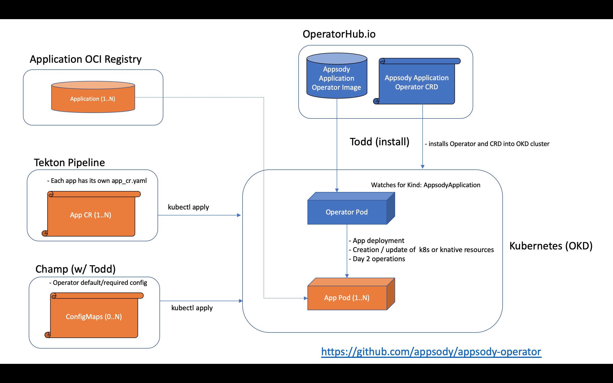

[](https://travis-ci.com/appsody/appsody-operator)
[](https://goreportcard.com/report/github.com/appsody/appsody-operator)

# Appsody Application Operator

The Appsody Application Operator has been designed to deploy applications created by [Appsody Application Stacks](https://appsody.dev/) into [OKD](https://www.okd.io/) clusters.  The goal of this project is to iterative grow the operator's set of day-2 capabilities.  If there's an certain functionality you would like to see or a bug you would like to report, please use our [issues tab](https://github.com/appsody/appsody-operator/issues) to get in contact with us.

## Operator Installation

You can install the Appsody Application Operator via a single `kubectl` command or assisted by the [Operator Lifecycle Manager](https://github.com/operator-framework/operator-lifecycle-manager).

### Direct installation

Use the instructions for one of the [releases](https://github.com/appsody/appsody-operator/tree/master/deploy/releases) to directly install this Operator into a Kubernetes cluster.

### OLM-assisted installation

*Note:* OLM is labelled as a tech preview for OKD / OpenShift 3.11.  

* install OLM as described in [here](https://github.com/operator-framework/operator-lifecycle-manager/blob/master/Documentation/install/install.md#installing-olm).
* install the operator via this command:

## Overview

The architecture of the Appsody Application Operator follows the basic controller pattern:  the Operator container with the controller is deployed into a Pod and listens for incoming resources with `Kind: AppsodyApplication`.   



## Application Deployments

Each application deployment will have a YAML file that specifies its configuration.  Here's an example:

```
apiVersion: appsody.dev/v1alpha1
kind: AppsodyApplication
metadata:
  name: example-appsodyapplication
spec:
  # Add fields here
  version: 1.0.0
  applicationImage: quay.io/arthurdm/myApp:1.0
  service:
    type: ClusterIP
    port: 9080
  expose: true
  storage:
    size: 2Gi
    mountPath: "/etc/websphere"
```

### Application deployment configuration

These are the available keys under the `spec` section of the Custom Resource file.  For the complete OpenAPI v3 representation of these values please see [this part](https://github.com/appsody/appsody-operator/blob/master/deploy/crds/appsody_v1alpha1_appsodyapplication_crd.yaml#L25) of the Custom Resource Definition.

The required fields are `applicationImage` and `stack`. 

| Parameter | Description |
|---|---|
| `version` | The version of the deployment. |
| `stack` | The name of the Appsody Application Stack that produced this application image. |
| `serviceAccountName` | The name of the OpenShift service account to be used during deployment. |
| `applicationImage` | The absolute name of the image to be deployed, containing the registry and the tag. |
| `pullPolicy` | The policy used when pulling the image.  One of: `Always`, `Never`, and `IfNotPresent`. |
| `pullSecret` | If using a registry that requires authentication, the name of the secret containing credentials. |
| `createAppDefinition` | This boolean toggles the creation of a top-level [Application](https://github.com/kubernetes-sigs/application)|. |
| `architecture` | An array of architectures to be considered for deployment.  Their position in the array indicates preference. |
| `service.port` | The port exposed by the container. |
| `service.type` | |The Kubernetes [Service Type](https://kubernetes.io/docs/concepts/services-networking/service/#publishing-services-service-types). |
| `createKnativeService`   | A boolean to toggle the creation of Knative resources and usage of Knative serving. |
| `expose`   | A boolean that toggles the external exposure of this deployment via a Route resource.|
| `replicas` | The number of desired replica pods that run simultaneously. |
| `autoscaling.maxReplicas` | Upper limit for the number of pods that can be set by the autoscaler.  Cannot be lower than the minimum number of replicas.|
| `autoscaling.minReplicas`   | Lower limit for the number of pods that can be set by the autoscaler.  Can only be 0 if `createKnativeService` is set to true. |
| `autoscaling.targetCPUUtilizationPercentage`   | Target average CPU utilization (represented as a percentage of requested CPU) over all the pods. |
| `resourceConstraints.requests.cpu` | The minimum required CPU core. Specify integers, fractions (e.g. 0.5), or millicore values(e.g. 100m, where 100m is equivalent to .1 core).|
| `resourceConstraints.requests.memory` | The minimum memory in bytes. Specify integers with one of these suffixes: E, P, T, G, M, K, or power-of-two equivalents: Ei, Pi, Ti, Gi, Mi, Ki.|
| `resourceConstraints.limits.cpu` | The upper limit of CPU core. Specify integers, fractions (e.g. 0.5), or millicores values(e.g. 100m, where 100m is equivalent to .1 core). |
| `resourceConstraints.limits.memory` | The memory upper limit in bytes. Specify integers with suffixes: E, P, T, G, M, K, or power-of-two equivalents: Ei, Pi, Ti, Gi, Mi, Ki.|
| `env`   | An array of environment variables following the format of `{name, value}`, where value is a simple string. |
| `envFrom`   | An array of environment variables following the format of `{name, valueFrom}`, where `valueFrom` is YAML object containing a property named either `secretKeyRef` or `configMapKeyRef`, which in turn contain the properties `name` and `key`.|
| `readinessProbe`   | A YAML object configuring the [Kubernetes readiness probe](https://kubernetes.io/docs/tasks/configure-pod-container/configure-liveness-readiness-probes/#define-readiness-probes) that controls when the pod is ready to receive traffic. |
| `livenessProbe` | A YAML object configuring the [Kubernetes liveness probe](https://kubernetes.io/docs/tasks/configure-pod-container/configure-liveness-readiness-probes/#define-a-liveness-http-request) that controls when Kubernetes needs to restart the pod.|
| `volume` | A YAML object representing a [pod volume](https://kubernetes.io/docs/concepts/storage/volumes). |
| `volumeMounts` | A YAML object representing a [pod volumeMount](https://kubernetes.io/docs/concepts/storage/volumes/). |
| `storage.size` | A convenience field to set the size of the persisted storage. Can be overriden by the `storage.VolumeClaimTemplate` property. |
| `storage.mountPath` | The directory inside the container where this persisted storage will be bound to. |
| `storage.VolumeClaimTemplate` | A YAML object representing a [volumeClaimTemplate](https://kubernetes.io/docs/concepts/workloads/controllers/statefulset/#components) component of a `StatefulSet`. |
