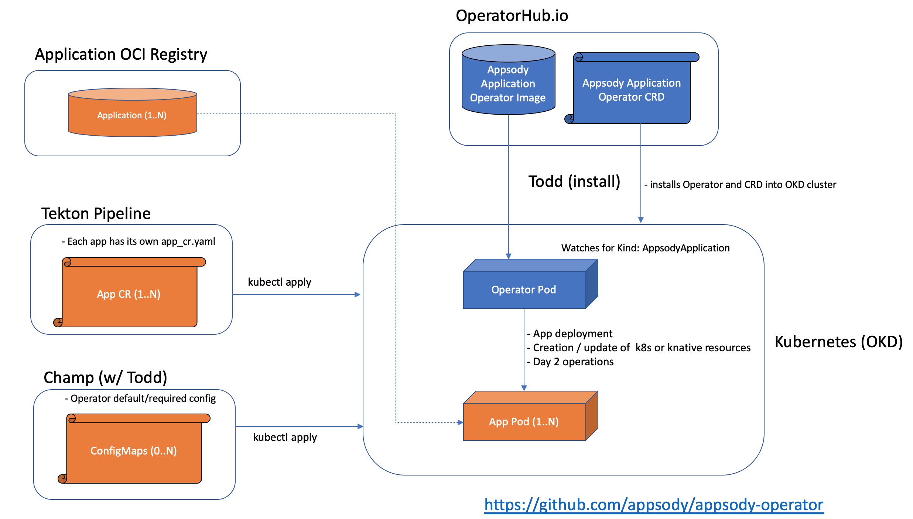

# Appsody Application Operator

The Appsody Application Operator has been designed to deploy applications created by [Appsody Application Stacks](https://appsody.dev/) into [OKD](https://www.okd.io/) clusters.  The goal of this project is to iterative grow the operator's set of day-2 capabilities.  If there's an certain functionality you would like to see or a bug you would like to report, please use our [issues tab](https://github.com/appsody/appsody-operator/issues) to get in contact with us.

## Operator Installation

You can install the Appsody Application Operator via a single `kubectl` command or assisted by the [Operator Lifecycle Manager](https://github.com/operator-framework/operator-lifecycle-manager).

### Direct installation

Run the following command to install the operator:  

* `kubectl apply -f <URL>`

### OLM-assisted installation

*Note:* OLM is labelled as a tech preview for OKD / OpenShift 3.11.  

* install OLM as described in [here](https://github.com/operator-framework/operator-lifecycle-manager/blob/master/Documentation/install/install.md#installing-olm)

## Overview

The architecture of the Appsody Application Operator follows the basic Controller pattern:  the Operator container with the controller is deployed into a Pod and listens for incoming resources with `Kind: AppsodyApplication`.  The 



## Application Deployments

Each application deployment will have a YAML file that specifies its configuration.  Here's an example:

```
apiVersion: appsody.dev/v1alpha1
kind: AppsodyApplication
metadata:
  name: example-appsodyapplication
spec:
  # Add fields here
  applicationImage: openliberty/open-liberty:javaee8-ubi-min
  service:
    type: ClusterIP
    port: 9080
  expose: true
  storage:
    size: 2Gi
    mountPath: "/etc/websphere"
```

### Application deployment configuration

| Parameter | Description |
|---|---|
| `image`   | `pullPolicy` |
